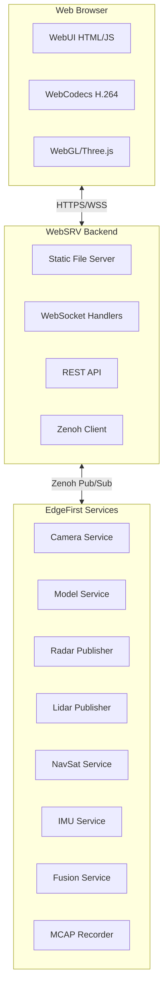
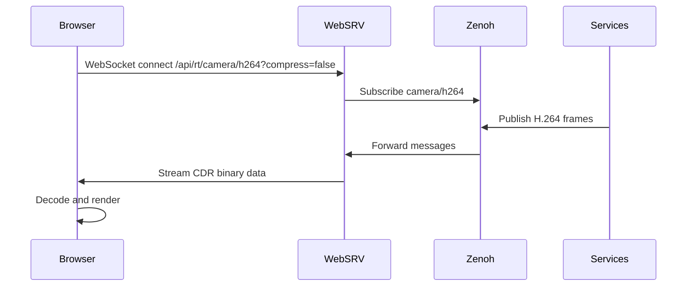
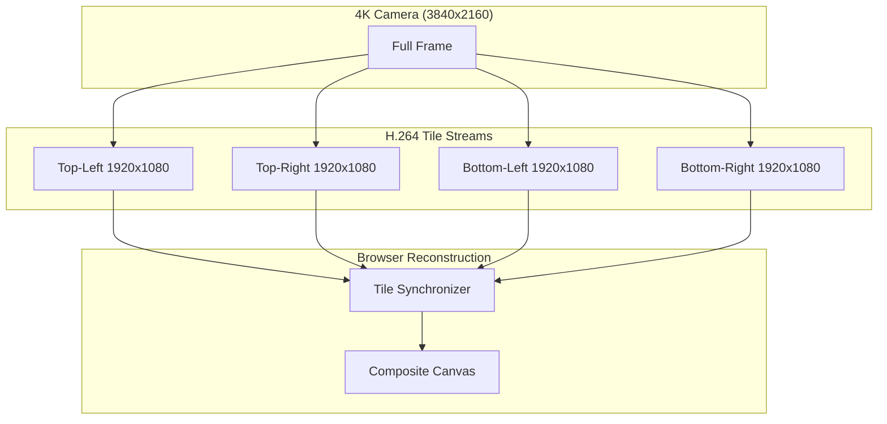
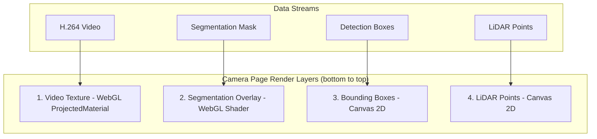
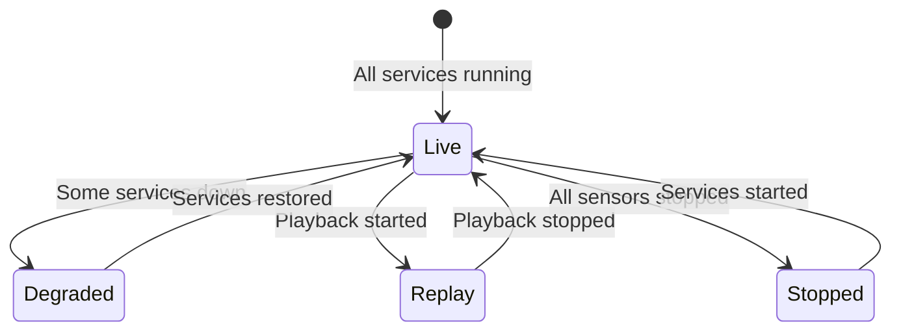
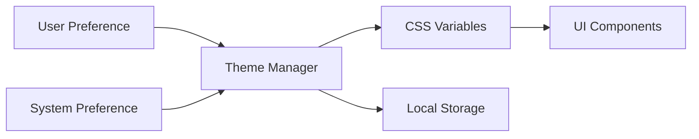

# EdgeFirst WebUI Architecture

**Version:** 2.0
**Author:** Sébastien Taylor <sebastien@au-zone.com>
**Last Updated:** 2026-03-11

## Overview

The EdgeFirst WebUI is a browser-based real-time visualization platform for the EdgeFirst Maivin and Raivin embedded AI platforms. It provides web-based access to:

- **H.264 Camera Streams** including tiled 4K video
- **AI Model Outputs** including detection boxes and segmentation masks
- **Sensor Point Clouds** from radar and lidar
- **GPS/IMU Data** for location and orientation
- **System Configuration** and service management
- **MCAP Recording** with EdgeFirst Studio integration

The WebUI is a static HTML/JavaScript application served by the [WebSRV](https://github.com/EdgeFirstAI/websrv) Rust backend server. Together, they form the EdgeFirst web visualization stack.

## System Architecture

The WebSRV acts as a **Zenoh-to-WebSocket bridge**: browsers connect via WebSocket, WebSRV subscribes to Zenoh topics, and messages are streamed to all connected clients using CDR binary serialization.

## Technology Stack

### Frontend (WebUI)

| Component | Technology | Purpose |
|-----------|------------|---------|
| 3D Rendering | Three.js r167 | WebGL scene rendering |
| 2D Overlays | Canvas API | Bounding boxes, labels |
| Video Codec | WebCodecs API | Hardware-accelerated H.264 |
| Styling | Tailwind CSS | Responsive design |
| Maps | Leaflet.js | GPS visualization |
| Compression | Zstandard (WASM) | Mask decompression |

### Backend (WebSRV)

| Component | Technology | Purpose |
|-----------|------------|---------|
| Web Framework | Actix-web | Async HTTP/WebSocket server |
| Message Bus | Zenoh | EdgeFirst service integration |
| Recording | MCAP | Data capture and playback |
| TLS | OpenSSL | HTTPS/SSL encryption |

## Data Flow

### WebSocket Topics

HTTP paths stay under `/api/rt/…`. WebSRV maps the path remainder to a bare
Zenoh application key (`camera/h264`); the session namespace prefixes the
hostname on the wire (`{hostname}/camera/h264`).

**Video Streaming:**
- `/api/rt/camera/h264?compress=false` → `camera/h264` — Single H.264 stream
- `/api/rt/camera/h264/{tl,tr,bl,br}?compress=false` → `camera/h264/{tl,tr,bl,br}` — Tiled 4K quadrants

**AI Outputs:**
- `/api/rt/model/output/` → `model/output` — Unified model output (boxes + masks)

**LiDAR & Fusion:**
- `/api/rt/lidar/points/` → `lidar/points` — Raw LiDAR point cloud (PointCloud2)
- `/api/rt/lidar/clusters/` → `lidar/clusters` — Enriched LiDAR with cluster/class IDs
- `/api/rt/fusion/lidar/` → `fusion/lidar` — Fused lidar data
- `/api/rt/tf_static/` → `tf_static` — Static transforms (LiDAR→camera extrinsics)
- `/api/rt/camera/info/` → `camera/info` — Camera intrinsics

**Sensors:**
- `/api/rt/radar/targets/` → `radar/targets` — Radar point cloud
- `/api/rt/fusion/radar/` → `fusion/radar` — Fused radar data
- `/api/rt/gps/` → `gps` — GPS position
- `/api/rt/imu/` → `imu` — IMU orientation

### Priority Queuing

- **High Priority** (capacity=16): Segmentation masks
- **Low Priority** (capacity=1): All other topics (only latest frame kept)

## Video Streaming

### Tiled 4K Architecture

The SmartVideoManager handles tile detection and synchronization:
- 5-second detection timeout
- Minimum 2 tiles required for tile mode
- Falls back to single stream if unavailable
- Frame sync at 15fps minimum with 500ms max wait
- Callback-based upgrade: `onUpgrade(tileTexture)` swaps the material texture and disposes the fallback

## Visualization Pages

### Primary Views

| Page | Description |
|------|-------------|
| `index.html` | Home page with visualization selector |
| `camera.html` | Camera stream with segmentation, bounding box, and LiDAR overlays |
| `lidar.html` | 3D LiDAR point cloud with colour modes and cluster filtering |
| `combined.html` | Split view: video, segmentation, radar grid |
| `grid.html` | Radar point cloud on a polar range/bearing grid with source, colour mode, and elevation controls |
| `segmentation.html` | Segmentation mask only |
| `jpeg.html` | JPEG camera viewer |
| `gps.html` | GPS map tracking |
| `imu.html` | IMU orientation display |

### Configuration Pages

Located under `/config/`:

| Page | Purpose |
|------|---------|
| `recorder.html` | MCAP recording and Studio upload |
| `camera.html` | Camera device settings |
| `model.html` | Model configuration |
| `lidarpub.html` | LiDAR publisher settings |
| `radarpub.html` | Radar publisher settings |
| `fusion.html` | Sensor fusion settings |
| `gpsd.html` | GPS daemon settings |
| `services.html` | Service status and control |
| `settings.html` | General settings hub |

#### Saving a Configuration

The seven service pages save through `js/configSave.js`, which owns the whole
`POST /api/config/{service}` round trip. It takes the service name and the
values, and returns `{ ok, level, message, body }`. Pages hide their loading
overlay and show `message`; `saveServiceConfig` never rejects, so no page
needs a `.catch` to avoid a stuck overlay.

`fileName` is added by the helper rather than by each page. WebSRV requires
it to match the `{service}` URL segment and answers 400 when they disagree —
deriving both from one argument leaves no way for a page to get it wrong.

WebSRV answers in JSON for every outcome, and the status code alone does not
say whether the save worked:

| Response | `level` | Shown to the user |
|----------|---------|-------------------|
| 200, `applied`, `restarted` | success | Saved and restarted. |
| 200, `applied`, not running | success | Saved; the service was not running, so it was not restarted. |
| 200, `restart_error` | warning | Saved, **but the unit failed to come back up**, with the systemd detail. |
| 200, not `applied` | info | No changes to save. |
| 400 with `rejected` | error | Each refused key and why. Nothing was written. |
| 400/404/500 with `error` | error | The message, plus the paths tried on a 404. |
| Transport failure or timeout | error | The server could not be reached, or did not answer in 30 s. |

The `restart_error` row is the reason `response.ok` is not enough on its own:
the file is written before the restart is attempted, so a restart failure
cannot be reported as an HTTP error without misreporting the write.

When a save reports keys under `unmatched`, those keys existed nowhere in the
file — active or commented — and were appended as new lines. The helper names
them in the message, since a key that matches nothing is usually a settings
page and a service that disagree about a variable's name.

## Combined Visualization

Each layer streams independently with proper z-ordering for composited visualization.

## Service Status

**Status Indicators:**
- **Green** - Live Mode (all critical services running)
- **Amber** - Degraded Mode (some services down)
- **Blue** - Replay Mode (MCAP playback active)
- **Red** - Stopped (all sensors stopped)

## Notifications

Every page reports outcomes through `window.showToast(message, level)`, defined
in `js/toast.js` and loaded ahead of `navbar.js` on all pages. It replaced
`alert()`, which blocked the page until acknowledged, rendered unstyled and
outside the theme, and could show only one result at a time — a second failure
had to wait for the first to be clicked away.

Four levels drive the accent colour, the ARIA role and how long a toast lives:

| Level | Lifetime | Role | Used for |
|-------|----------|------|----------|
| `success` | 5 s | `status` | A save applied, signing out of Studio |
| `info` | 5 s | `status` | Nothing to do — the file already held these values |
| `warning` | 10 s | `alert` | Applied with a caveat — saved but the unit did not restart |
| `error` | until dismissed | `alert` | Nothing was applied, or the request failed |

An error carries detail the user has to act on — a rejected save names every
refused key and why — so it waits to be dismissed, as `alert()` did. Toasts
stack rather than replace, so several failures in a row each stay readable
instead of overwriting one another. A bulk dismiss appears once three are
showing.

Surviving an open modal `<dialog>` takes two separate things, and several
callers report from inside one — the MCAP file browser and the play options
modal among them.

*Painting.* A modal dialog renders in the browser's top layer, above every
ordinary stacking context, so a plain fixed toast is painted behind it whatever
its `z-index`. The container is a **popover**, which shares that top layer.

*Interaction.* `showModal()` additionally makes everything outside the dialog's
subtree **inert**, and inert content cannot be clicked. A popover parented to
`<body>` is therefore visible above an open dialog but its dismiss button does
nothing — which strands an error toast, because errors wait to be dismissed.
The container instead follows the topmost modal dialog, moving inside it while
one is open and back to `<body>` when it closes, so it stays in the non-inert
subtree. A `MutationObserver` on the `open` attribute catches a dialog opened
*after* a toast is already showing, and re-enters the top layer so the dialog
does not paint over it.

Browsers without popover support fall back to fixed positioning, correct
everywhere except on top of an open dialog.

Styling lives in `css/theme.css` and uses the existing `--color-status-*`
tokens, so toasts follow light, dark and auto themes with no extra work.

## Theme System

The WebUI supports light and dark themes via CSS custom properties:

Theme selection follows priority: user preference > system preference > default (light).

## Browser Requirements

- **WebCodecs API** - Hardware H.264 decoding (Chrome 94+, Edge 94+)
- **WebGL 2.0** - Three.js rendering
- **WebSockets** - Real-time streaming
- **ES6 Modules** - Native module support
- **Popover API** - Toast notifications above modal dialogs (Chrome 114+, Edge
  114+); older browsers fall back to fixed positioning

## Deployment

The WebUI and WebSRV are deployed together:

1. **WebUI** - Static files served from `--docroot` directory
2. **WebSRV** - HTTPS server on port 443 (HTTP redirects from 80)

Default locations:
- `/usr/share/webui` (system, read-only)
- `/home/torizon/webui` (user customizations)
- `/usr/local/share/webui` (local installs)

Configure via `/etc/default/webui` with `DOCROOT` variable.

## Related Documentation

- [WebSRV Architecture](https://github.com/EdgeFirstAI/websrv/blob/main/ARCHITECTURE.md)
- [EdgeFirst Documentation](https://doc.edgefirst.ai/)
- [TESTING.md](TESTING.md) - Testing procedures
