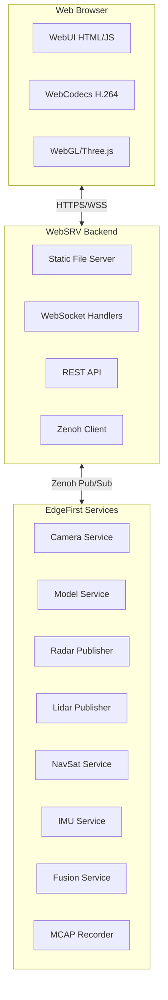
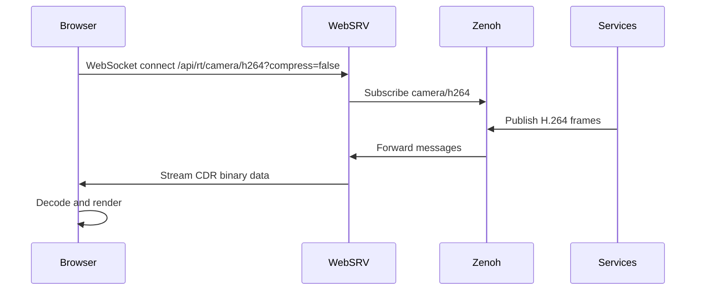
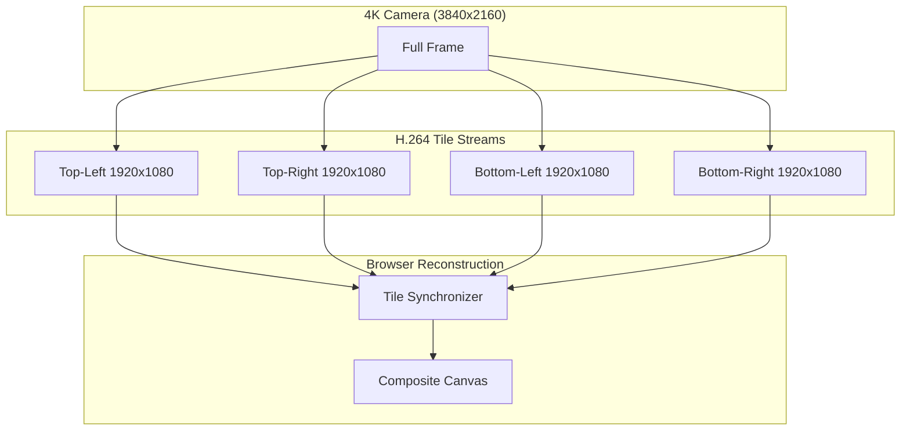
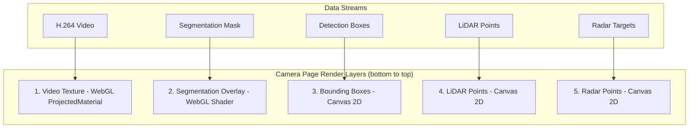
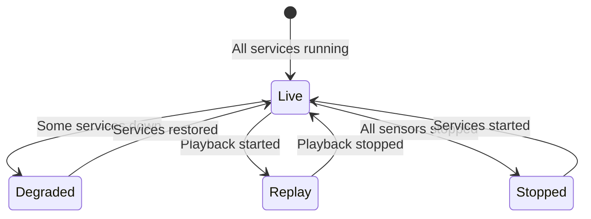
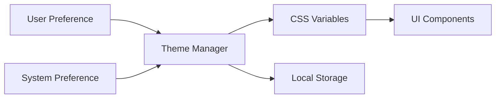

# EdgeFirst WebUI Architecture

**Version:** 2.0
**Author:** Sébastien Taylor <sebastien@au-zone.com>
**Last Updated:** 2026-03-11

## Overview

The EdgeFirst WebUI is a browser-based real-time visualization platform for the EdgeFirst Maivin and Raivin embedded AI platforms. It provides web-based access to:

- **H.264 Camera Streams** including tiled 4K video
- **AI Model Outputs** including detection boxes and segmentation masks
- **Sensor Point Clouds** from radar and lidar
- **GPS/IMU Data** for location and orientation
- **System Configuration** and service management
- **MCAP Recording** with EdgeFirst Studio integration

The WebUI is a static HTML/JavaScript application served by the [WebSRV](https://github.com/EdgeFirstAI/websrv) Rust backend server. Together, they form the EdgeFirst web visualization stack.

## System Architecture


```mermaid
flowchart TB
    subgraph Browser["Web Browser"]
        UI[WebUI HTML/JS]
        WC[WebCodecs H.264]
        WGL[WebGL/Three.js]
    end

    subgraph WebSRV["WebSRV Backend"]
        HTTP[Static File Server]
        WS[WebSocket Handlers]
        API[REST API]
        ZC[Zenoh Client]
    end

    subgraph Services["EdgeFirst Services"]
        CAM[Camera Service]
        MDL[Model Service]
        RAD[Radar Publisher]
        LID[Lidar Publisher]
        NAV[NavSat Service]
        IMU[IMU Service]
        FUS[Fusion Service]
        REC[MCAP Recorder]
    end

    Browser <-->|HTTPS/WSS| WebSRV
    WebSRV <-->|Zenoh Pub/Sub| Services
```

The WebSRV acts as a **Zenoh-to-WebSocket bridge**: browsers connect via WebSocket, WebSRV subscribes to Zenoh topics, and messages are streamed to all connected clients using CDR binary serialization.

## Technology Stack

### Frontend (WebUI)

| Component | Technology | Purpose |
|-----------|------------|---------|
| 3D Rendering | Three.js r186, three-spritetext 1.10.0 | WebGL scene rendering |
| 2D Overlays | Canvas API | Bounding boxes, labels |
| Video Codec | WebCodecs API | Hardware-accelerated H.264 |
| Styling | Tailwind CSS 3.4.17 (Play CDN build), daisyUI 3.9.4 | Responsive design |
| Maps | Leaflet 1.9.4, tinyworldmap (offline tiles) | GPS visualization |
| Compression | Zstandard (WASM) | Mask decompression |
| Messages | @foxglove/cdr 3.5.1 | CDR deserialization |

### Backend (WebSRV)

| Component | Technology | Purpose |
|-----------|------------|---------|
| Web Framework | Actix-web | Async HTTP/WebSocket server |
| Message Bus | Zenoh | EdgeFirst service integration |
| Recording | MCAP | Data capture and playback |
| TLS | OpenSSL | HTTPS/SSL encryption |

## Data Flow


```mermaid
sequenceDiagram
    participant B as Browser
    participant W as WebSRV
    participant Z as Zenoh
    participant S as Services

    B->>W: WebSocket connect /api/rt/camera/h264?compress=false
    W->>Z: Subscribe camera/h264
    S->>Z: Publish H.264 frames
    Z->>W: Forward messages
    W->>B: Stream CDR binary data
    B->>B: Decode and render
```

### WebSocket Topics

HTTP paths stay under `/api/rt/…`. WebSRV maps the path remainder to a bare
Zenoh application key (`camera/h264`); the session namespace prefixes the
hostname on the wire (`{hostname}/camera/h264`).

**Video Streaming:**
- `/api/rt/camera/h264?compress=false` → `camera/h264` — Single H.264 stream
- `/api/rt/camera/h264/{tl,tr,bl,br}?compress=false` → `camera/h264/{tl,tr,bl,br}` — Tiled 4K quadrants

**AI Outputs:**
- `/api/rt/model/output/` → `model/output` — Unified model output (boxes + masks)

**LiDAR & Fusion:**
- `/api/rt/lidar/points/` → `lidar/points` — Raw LiDAR point cloud (PointCloud2)
- `/api/rt/lidar/clusters/` → `lidar/clusters` — Enriched LiDAR with cluster/class IDs
- `/api/rt/fusion/lidar/` → `fusion/lidar` — Fused lidar data
- `/api/rt/tf_static/` → `tf_static` — Static transforms (`base_link` → LiDAR, radar and camera optical extrinsics)
- `/api/rt/camera/info/` → `camera/info` — Camera intrinsics

**Sensors:**
- `/api/rt/radar/targets/` → `radar/targets` — Radar point cloud
- `/api/rt/fusion/radar/` → `fusion/radar` — Fused radar data
- `/api/rt/gps/` → `gps` — GPS position
- `/api/rt/imu/` → `imu` — IMU orientation

### Priority Queuing

- **High Priority** (capacity=16): Segmentation masks
- **Low Priority** (capacity=1): All other topics (only latest frame kept)

## Video Streaming

### Tiled 4K Architecture


```mermaid
graph TB
    subgraph Camera["4K Camera (3840x2160)"]
        FULL[Full Frame]
    end

    subgraph Tiles["H.264 Tile Streams"]
        TL[Top-Left 1920x1080]
        TR[Top-Right 1920x1080]
        BL[Bottom-Left 1920x1080]
        BR[Bottom-Right 1920x1080]
    end

    subgraph Browser["Browser Reconstruction"]
        SYNC[Tile Synchronizer]
        CANVAS[Composite Canvas]
    end

    FULL --> TL & TR & BL & BR
    TL & TR & BL & BR --> SYNC
    SYNC --> CANVAS
```

The SmartVideoManager handles tile detection and synchronization:
- 5-second detection timeout
- Minimum 2 tiles required for tile mode
- Falls back to single stream if unavailable
- Tiles are decoded to bitmaps and grouped by `header.stamp` by `TileAssembler`; a merged frame is built only from tiles of the same frame and takes that frame's stamp. A group is merged once all tiles have arrived or, with the tiles it has, 100 ms (three tile periods at 30 fps) after its first tile; the merged canvas is persistent, so a lost tile leaves the previous picture in its quadrant. Only the newest ready group is merged, older ones are closed, and late tiles of an already merged stamp are discarded. Merging is limited to one merged frame per 60 ms, which is 15 fps from 30 fps tiles; a group ready sooner is held and merged on the first tile after the interval unless a newer group is ready by then. A tile more than 2 s from the last merged stamp counts as a clock step only once most tile streams show the new time, or once no tile of the old time has arrived for 100 ms (so a step is still followed when some tile streams have stopped), so one lagging stream cannot reset the merge while the others keep delivering
- Merged frames are delivered as `onMergedFrame(stampMs, bitmap)`
- Callback-based upgrade: `onUpgrade(tileTexture)` swaps the material texture and disposes the fallback

## Temporal Synchronization

The camera, segmentation and combined pages draw each overlay for the camera frame it belongs to instead of the newest sample received. Frames are held briefly so the overlays for a frame have arrived by the time it is shown.

### Stamp Contract

- Acquisition time is carried in `header.stamp` (`sec` and `nanosec`, both uint32) and equals the Zenoh sample timestamp to within NTP64 resolution. The UI reads the CDR header, so the WebSocket protocol carries no separate timestamp.
- Camera-derived outputs (`model/output`, `model/info`) carry the exact `header.stamp` of the camera frame they were computed from.
- LiDAR and radar carry their own acquisition stamps, which never equal a camera stamp.
- `stampToMs(sec, nanosec)` in `stamp.js` converts a stamp to milliseconds since the Unix epoch; identical stamps give identical numbers, so the value is safe as an exact-match key.
- H.264 chunks are tagged with a sequence number and `StampTracker` recovers the stamp from `VideoFrame.timestamp`, so each decoded frame carries its own stamp however many frames the decoder holds in flight.

### Modules

| Module | Role |
|--------|------|
| `stamp.js` | `stampToMs`, `readHeaderStampMs`, `StampTracker` and the `DISCONTINUITY_MS` constant (2000 ms). |
| `StampBuffer.js` | Per-stream buffer ordered by stamp with `exact`, `atOrBefore` and `nearest` lookups, plus the `selectDerived` and `selectSensor` policies. |
| `PlayoutClock.js` | Learns how late each stream arrives and derives the playout delay. |
| `FrameSync.js` | Holds decoded camera frames until the playout delay has passed and releases the frame that is due; never releases a frame older than the last one released. |
| `TileAssembler.js` | Groups decoded 4K tiles by exact `header.stamp` and emits complete groups, or partial groups after 100 ms, at most one per `minIntervalMs`. |
| `SyncedVideo.js` | `createSyncedVideo()` wires `SmartVideoManager`, `FrameSync` and `PlayoutClock`; `tick()` draws the due frame and returns its stamp. |

The stamp, buffer, clock, frame and tile modules, and the overlay modules `projection.js`, `radarOverlay.js`, `colorMaps.js`, `reconnectingSocket.js`, `topicGate.js` and `serviceGate.js` (see Camera Page Sensor Overlays), import nothing that touches the DOM, WebGL or Three.js, so they are unit tested with `node --test`.

### Overlay Selection Policy

Each animation frame the page calls `video.tick()`, which returns the stamp of the frame now on screen, and selects every enabled overlay against that stamp.

| Stream | Pages | Buffer capacity | Selection |
|--------|-------|-----------------|-----------|
| Model output | camera, segmentation, combined | 32 | The result with the exact frame stamp; otherwise the newest earlier result, held for up to two model periods (clamped to 50-250 ms, 250 ms when the period is unknown). Never a result newer than the frame. |
| LiDAR points and clusters | camera | 32 | The sample nearest the frame stamp within half the sensor period plus 10 ms (60 ms until the period is known). No sample inside the tolerance means no overlay. |
| Radar | camera, combined | 64 | The same nearest-sample rule as LiDAR. The larger buffer covers the lag of the displayed video behind radar, which arrives earlier than the video. |

The model runs slower than the camera, so a frame the model did not process shows the held result of the last processed frame. Overlays disappear once nothing inside the window remains, so boxes and points do not stay on screen after detections or points stop. On `/combined` the distance and speed labels on each box follow the radar sample selected for the displayed frame. The bird's-eye radar grid on `/combined` shows the latest radar data.

`lidar.html` and `grid.html` are single-sensor views with no video to align to, so they intentionally show the latest sample.

### Playout Delay

`PlayoutClock` records `arrival - stamp` for every message of each observed stream over a window of 60 samples. The offsets mix the browser clock with the device clock, but only differences between streams are used, so the clock skew cancels.

```text
lag(stream)   = p95(offsets of stream) - median(offsets of camera)
delay         = clamp(0, 1000 ms, max over enabled overlay streams of (lag + tolerance + 10 ms))
```

`tolerance` is the sensor selection tolerance for LiDAR and radar and 0 for the model. `FrameSync` releases the newest queued frame that has waited at least `delay` since it arrived and drops older frames. Its queue holds 30 frames (12 in 4K tile mode, where frames are large); when the queue is full its oldest frame is released even if not yet due, so a delay longer than the queue spans (12 frames at 15 merged frames per second is about 800 ms) shortens the effective delay instead of freezing the video. A frame is dropped for capacity only when another arrives while the queue is full, that is when no `tick()` ran in between. A frame whose stamp is at or before the last released one (decoded frames can reach the page out of order on a loaded client) is closed on arrival, so displayed stamps never go backwards. The cost is bounded by `DISCONTINUITY_MS`: after a released frame up to 2 s ahead of the stream, or a real backward step smaller than 2 s, no frame is shown until the stream passes the last shown stamp, for at most 2 s.

- A stream with no arrival for more than 2 s is ignored.
- A stream whose lag against the camera exceeds 2 s (`DISCONTINUITY_MS`) is treated as being in another clock domain, which is what a clock step looks like until the camera catches up. It is reported in the statistics but does not contribute to the delay. The trade-off is that a stream that is genuinely more than 2 s late contributes no delay.
- The delay is capped at 1000 ms.
- On `/camera`, turning an overlay off removes its stream from the clock (`model` for boxes and segmentation, `lidar` and `lidarEnriched` for LiDAR, `radar` for radar), so with every overlay off the delay is 0 and the video is live. `/segmentation` and `/combined` observe the model (and radar) stream for as long as it arrives, so their delay follows that stream's lag and falls to 0 only after the stream has been silent for more than 2 s.

### Discontinuity Handling

The device wall clock can step forward or backward at any moment. Stamps further than `DISCONTINUITY_MS` (2 s) from the previous sample of the same stream are a step, not data:

- `StampBuffer` and `FrameSync` flush what they hold and start again from the new stamp; `FrameSync` also treats a frame more than 2 s from the last released stamp as a step.
- `TileAssembler` restarts once most tile streams have delivered a tile of the new time, or once no tile of the old time has arrived for 100 ms; until then those tiles are held aside.
- `PlayoutClock` discards a stream's offsets when a new offset is more than 2 s from their median and relearns.

Overlays recover without a page reload.

### Diagnostics

`createSyncedVideo().reportSync(selections)` publishes `window.overlaySync` every animation frame: `displayedStampMs`, `delayMs`, `streams` (per-stream `lagMs` and `samples`) and, for each selection the page reports, `modelDeltaMs`, `lidarDeltaMs` or `radarDeltaMs`. A delta is the displayed stamp minus the selected sample's stamp, or `null` when no sample is selected. `/camera` reports `modelDeltaMs`, `lidarDeltaMs` and `radarDeltaMs` (each `null` while its overlay is off) and also shows the delay and per-stream lag in a statistics box.

## Visualization Pages

### Primary Views

| Page | Description |
|------|-------------|
| `index.html` | Home page with visualization selector |
| `camera.html` | Camera stream with segmentation, bounding box, LiDAR and radar overlays |
| `lidar.html` | 3D LiDAR point cloud with colour modes and cluster filtering |
| `combined.html` | Split view: video, segmentation, radar grid |
| `grid.html` | Radar point cloud on a polar range/bearing grid with source, colour mode, and elevation controls |
| `segmentation.html` | Segmentation mask only |
| `jpeg.html` | JPEG camera viewer |
| `gps.html` | GPS map tracking |
| `imu.html` | IMU orientation display |

### Configuration Pages

Located under `/config/`:

| Page | Purpose |
|------|---------|
| `recorder.html` | MCAP recording and Studio upload |
| `camera.html` | Camera device settings |
| `model.html` | Model configuration |
| `lidarpub.html` | LiDAR publisher settings |
| `radarpub.html` | Radar publisher settings |
| `fusion.html` | Sensor fusion settings |
| `gpsd.html` | GPS daemon settings |
| `services.html` | Service status and control |
| `settings.html` | General settings hub |

#### Which Options a Page Exposes

A page exposes exactly the options its service accepts, minus the Zenoh
transport settings (`CONNECT`, `LISTEN`, `MODE`, `NO_MULTICAST_SCOUTING`),
which are deployment topology rather than user configuration and are managed
outside the web UI.

The authority is the service's own `clap` argument definitions — every
control's key, type, allowed values and documented default comes from there,
not from the shipped `.default` file, which may lag. A control whose key the
service does not accept is worse than useless: since WebSRV 4.2.0 appends
keys that are absent from the file, it writes a dead line into
`/etc/default/*` on every save. Before then such a key was silently dropped,
which is how nine of them survived unnoticed.

Topic names (`*_TOPIC`), frame IDs, profiling switches (`TRACY`,
`TOKIO_CONSOLE`) and replay/debug paths are deliberately not exposed. They
are pipeline plumbing or developer tooling, not operator settings.

`gpsd.html` is the exception: gpsd is a Debian package rather than an
EdgeFirst service, so its options cannot be checked against source in this
tree.

**A blank control means "use the service default."** It posts `KEY=""`, and
every service scrubs empty environment variables bound to its own arguments
before `clap` sees them, so the default applies. This is load-bearing: clap
treats a present-but-empty variable as a supplied value, so without the
scrub `JPEG=""` would be "a value is required" and `MIRROR=""` an invalid
enum, and a page of untouched controls would stop the service from starting.

The exception is a variable on a service's `KEEP` list, where `""` is the
documented "leave empty to disable" sentinel and is preserved rather than
scrubbed. All four of fusion's — `LIDAR_OUTPUT_TOPIC`, `RADAR_OUTPUT_TOPIC`,
`VISION_MODEL_TOPIC`, `MODEL_INFO_TOPIC` — are topics, and so are not
exposed. Any future control for a `KEEP` variable must treat blank as
*disabled*, not as *default*.

#### Saving a Configuration

The seven service pages save through `js/configSave.js`, which owns the whole
`POST /api/config/{service}` round trip. It takes the service name and the
values, and returns `{ ok, level, message, body }`. Pages hide their loading
overlay and show `message`; `saveServiceConfig` never rejects, so no page
needs a `.catch` to avoid a stuck overlay.

`fileName` is added by the helper rather than by each page. WebSRV requires
it to match the `{service}` URL segment and answers 400 when they disagree —
deriving both from one argument leaves no way for a page to get it wrong.

WebSRV answers in JSON for every outcome, and the status code alone does not
say whether the save worked:

| Response | `level` | Shown to the user |
|----------|---------|-------------------|
| 200, `applied`, `restarted` | success | Saved and restarted. |
| 200, `applied`, not running | success | Saved; the service was not running, so it was not restarted. |
| 200, `restart_error` | warning | Saved, **but the unit failed to come back up**, with the systemd detail. |
| 200, not `applied` | info | No changes to save. |
| 400 with `rejected` | error | Each refused key and why. Nothing was written. |
| 400/404/500 with `error` | error | The message, plus the paths tried on a 404. |
| Transport failure or timeout | error | The server could not be reached, or did not answer in 30 s. |

The `restart_error` row is the reason `response.ok` is not enough on its own:
the file is written before the restart is attempted, so a restart failure
cannot be reported as an HTTP error without misreporting the write.

When a save reports keys under `unmatched`, those keys existed nowhere in the
file — active or commented — and were appended as new lines. The helper names
them in the message, since a key that matches nothing is usually a settings
page and a service that disagree about a variable's name.

## Combined Visualization


```mermaid
flowchart TB
    subgraph Streams["Data Streams"]
        H264[H.264 Video]
        MASK[Segmentation Mask]
        BOXES[Detection Boxes]
        LIDAR[LiDAR Points]
        RADAR[Radar Targets]
    end

    subgraph Rendering["Camera Page Render Layers (bottom to top)"]
        L1[1. Video Texture - WebGL ProjectedMaterial]
        L2[2. Segmentation Overlay - WebGL Shader]
        L3[3. Bounding Boxes - Canvas 2D]
        L4[4. LiDAR Points - Canvas 2D]
        L5[5. Radar Points - Canvas 2D]
    end

    H264 --> L1
    MASK --> L2
    BOXES --> L3
    LIDAR --> L4
    RADAR --> L5
```

Each layer streams independently with proper z-ordering for composited visualization.

### Camera Page Sensor Overlays

The LiDAR and radar overlays project sensor points onto the 1920×1080 image with the pinhole model and draw them on their own 2D canvases (`#lidar-overlay`, then `#radar-overlay` on top). Each overlay clears only its own canvas every frame and when it is turned off, so either can be on alone.

- **Extrinsics:** both overlays read `/tf_static`, which repeats every transform about once a second. The matrix from sensor to camera optical frame is `inv(T_base_camera_optical) * T_base_sensor`, where the sensor transform is the child frame containing `lidar` or `radar` (radarpub publishes `base_link` → `radar` from `RADAR_TF_VEC`/`RADAR_TF_QUAT`) and the camera transform prefers `camera_optical` over `base_link_optical`. The math lives in `projection.js`.
- **Intrinsics:** `fx`, `fy`, `cx` and `cy` come from the `K` matrix of the first calibrated `/camera/info` message.
- **Topic gating:** the LiDAR section is shown while `lidar/points` is being published and the radar section while `radar/targets` is, whoever publishes it (a systemd service, a publisher started by hand, or a replay). `camera.js` polls `GET /api/topics/status?topics=lidar/points,radar/targets` every 2 s; websrv reports a topic `available` when a sample arrived within the last 3 s, and the first request for a topic starts the watch and reports it unavailable. A section shows on the first `available: true` and hides only after its topic has been unavailable for 10 s of consecutive polls; while an overlay is on, a sample of its own stream within the last 3 s also counts as available. When a section hides with its overlay on, the toggle is turned off, which closes the overlay's sockets and removes its stream from the playout clock; when the topic returns the section shows with the overlay off. Both sections start hidden and nothing changes before the first response, so they never flash. Errors after a successful poll hold the current state and polling continues.
- **Fallback for older websrv:** if the first poll gets a 404, a non-JSON answer (websrv 4.2 and 4.3 serve their HTML fallback) or a network error, the sections follow the service-enabled gate instead (`lidarpub` and `radarpub` enabled in systemd, refreshed through `serviceCache.registerUpdateCallback`; `serviceGate.js`), the endpoint is no longer polled, and it is tried once more after 60 s in case websrv was upgraded. The decisions live in `topicGate.js`.
- **Shared calibration sockets:** the `/tf_static` and `/camera/info` sockets stay open while either overlay is on and close, forgetting the camera calibration, when both are off.
- **Reconnects:** every overlay socket (`/tf_static`, `/camera/info`, LiDAR, enriched LiDAR and radar) is a `reconnectingSocket.js` handle that reconnects with backoff from 1 s doubling to 8 s. Turning an overlay off calls `stop()`, which also cancels a pending reconnect, so toggling during a backoff never leaves a second socket behind.
- **Missing calibration:** when the radar transform, camera transform or intrinsics have not arrived 5 s after the radar overlay is turned on, the page logs one warning naming what is missing and draws no radar points. Radar is still buffered and observed for the playout delay.
- **Clipping:** points behind the camera, with non-finite coordinates, or whose dot lies wholly outside the image are skipped.

Radar overlay (`radarOverlay.js` for the logic, `camera.js` for the wiring):

| Colour mode | Offered when | Scale |
|-------------|--------------|-------|
| Fixed | always | The colour from the colour picker (default `#ff00ff`). |
| Range | always | Turbo over 0-30 m of sensor range, the same scale as the LiDAR Distance mode. |
| Speed | `speed` field present | Diverging: negative (approaching) towards blue, zero grey, positive (receding) towards red, normalised by the fastest point in the sample with a 1 m/s floor, as on the radar grid page. |
| Power, RCS | `power` or `rcs` field present | Turbo stretched over the sample's minimum to maximum, as on the radar grid page. |

A mode whose field is missing from a sample falls back to Range. Points are filled circles with a 6 px radius and a dark outline, drawn farthest first; the LiDAR dots are 7 px squares. The page parses each radar sample once and rebuilds the projected points only when the selected sample, the calibration or the colour settings change. A sensor→camera matrix is recomputed only when the values of its own transform or the camera's change, so the once-a-second `/tf_static` repeats do not invalidate the cache. The colour mode and fixed colour persist in `localStorage` under `camera.radarOverlay`; like every `/camera` overlay, the radar overlay starts off on each page load.

## Service Status


```mermaid
stateDiagram-v2
    [*] --> Live: All services running
    Live --> Degraded: Some services down
    Live --> Replay: Playback started
    Degraded --> Live: Services restored
    Replay --> Live: Playback stopped
    Live --> Stopped: All sensors stopped
    Stopped --> Live: Services started
```

**Status Indicators:**
- **Green** - Live Mode (all critical services running)
- **Amber** - Degraded Mode (some services down)
- **Blue** - Replay Mode (MCAP playback active)
- **Red** - Stopped (all sensors stopped)

## Notifications

Every page reports outcomes through `window.showToast(message, level)`, defined
in `js/toast.js` and loaded ahead of `navbar.js` on all pages. It replaced
`alert()`, which blocked the page until acknowledged, rendered unstyled and
outside the theme, and could show only one result at a time — a second failure
had to wait for the first to be clicked away.

Four levels drive the accent colour, the ARIA role and how long a toast lives:

| Level | Lifetime | Role | Used for |
|-------|----------|------|----------|
| `success` | 5 s | `status` | A save applied, signing out of Studio |
| `info` | 5 s | `status` | Nothing to do — the file already held these values |
| `warning` | 10 s | `alert` | Applied with a caveat — saved but the unit did not restart |
| `error` | until dismissed | `alert` | Nothing was applied, or the request failed |

An error carries detail the user has to act on — a rejected save names every
refused key and why — so it waits to be dismissed, as `alert()` did. Toasts
stack rather than replace, so several failures in a row each stay readable
instead of overwriting one another. A bulk dismiss appears once three are
showing.

Surviving an open modal `<dialog>` takes two separate things, and several
callers report from inside one — the MCAP file browser and the play options
modal among them.

*Painting.* A modal dialog renders in the browser's top layer, above every
ordinary stacking context, so a plain fixed toast is painted behind it whatever
its `z-index`. The container is a **popover**, which shares that top layer.

*Interaction.* `showModal()` additionally makes everything outside the dialog's
subtree **inert**, and inert content cannot be clicked. A popover parented to
`<body>` is therefore visible above an open dialog but its dismiss button does
nothing — which strands an error toast, because errors wait to be dismissed.
The container instead follows the topmost modal dialog, moving inside it while
one is open and back to `<body>` when it closes, so it stays in the non-inert
subtree. A `MutationObserver` on the `open` attribute catches a dialog opened
*after* a toast is already showing, and re-enters the top layer so the dialog
does not paint over it.

Browsers without popover support fall back to fixed positioning, correct
everywhere except on top of an open dialog.

Styling lives in `css/theme.css` and uses the existing `--color-status-*`
tokens, so toasts follow light, dark and auto themes with no extra work.

## Theme System

The WebUI supports light and dark themes via CSS custom properties:


```mermaid
flowchart LR
    USER[User Preference] --> TM[Theme Manager]
    SYS[System Preference] --> TM
    TM --> CSS[CSS Variables]
    CSS --> UI[UI Components]
    TM --> LS[Local Storage]
```

Theme selection follows priority: user preference > system preference > default (light).

## Browser Requirements

- **WebCodecs API** - Hardware H.264 decoding (Chrome 94+, Edge 94+)
- **WebGL 2.0** - Three.js rendering
- **WebSockets** - Real-time streaming
- **ES6 Modules** - Native module support
- **Popover API** - Toast notifications above modal dialogs (Chrome 114+, Edge
  114+); older browsers fall back to fixed positioning

## Deployment

The WebUI and WebSRV are deployed together:

1. **WebUI** - Static files served from `--docroot` directory
2. **WebSRV** - HTTPS server on port 443 (HTTP redirects from 80)

Default locations:
- `/usr/share/webui` (system, read-only)
- `/home/torizon/webui` (user customizations)
- `/usr/local/share/webui` (local installs)

Configure via `/etc/default/webui` with `DOCROOT` variable.

## Related Documentation

- [WebSRV Architecture](https://github.com/EdgeFirstAI/websrv/blob/main/ARCHITECTURE.md)
- [EdgeFirst Documentation](https://doc.edgefirst.ai/)
- [TESTING.md](TESTING.md) - Testing procedures
