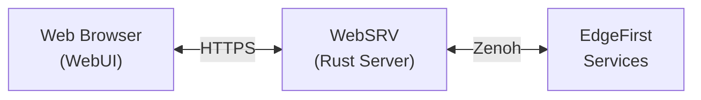

# EdgeFirst WebUI

[](https://opensource.org/licenses/Apache-2.0)

Browser-based real-time visualization platform for the EdgeFirst Maivin and Raivin embedded AI platforms.

## Overview

The EdgeFirst WebUI provides web-based access to:

- **Live Camera Streams** - H.264 video with hardware-accelerated decoding, including tiled 4K
- **AI Model Outputs** - Object detection bounding boxes and segmentation masks
- **Sensor Visualization** - Radar and lidar point clouds in 2D grid and 3D views
- **GPS/IMU Display** - Real-time position tracking and orientation visualization
- **System Configuration** - Service management, model settings, and device configuration
- **MCAP Recording** - Record, playback, and upload sessions to EdgeFirst Studio

## Architecture

The WebUI is a static HTML/JavaScript application that requires the [WebSRV](https://github.com/EdgeFirstAI/websrv) backend server. Together they form the EdgeFirst web visualization stack:



- **WebUI** - Frontend visualization (this project)
- **WebSRV** - HTTPS server, Zenoh-to-WebSocket bridge, REST API

Both projects are typically deployed together on Maivin/Raivin devices.

## Quick Start

### On Device

The WebUI comes pre-installed on EdgeFirst devices at `/usr/share/webui`. Access via browser:

```
https://<device-hostname>.local
```

### Development

For local development or customization:

```bash
# Clone the repository
git clone https://github.com/EdgeFirstAI/webui.git

# No build step required - static files only
# Copy to device or serve with WebSRV locally
```

## Deployment

### Custom WebUI Deployment

To deploy customized WebUI files on a device:

1. Copy files to a writable location:
   ```bash
   scp -r src/* torizon@maivin.local:/home/torizon/webui/
   ```

2. Update WebSRV configuration:
   ```bash
   # Edit /etc/default/webui
   DOCROOT=/home/torizon/webui
   ```

3. Restart the service:
   ```bash
   sudo systemctl restart webui
   ```

### Deployment Locations

| Location | Description |
|----------|-------------|
| `/usr/share/webui` | System default (read-only) |
| `/home/torizon/webui` | User customizations |
| `/usr/local/share/webui` | Local installs (requires sudo) |

## Project Structure

```
webui/
├── src/
│   ├── index.html          # Home page
│   ├── camera.html         # Camera visualization
│   ├── combined.html       # Multi-modal view
│   ├── combined_lidar.html # 3D lidar view
│   ├── grid.html           # Occupancy grid
│   ├── segmentation.html   # Segmentation only
│   ├── gps.html            # GPS map
│   ├── imu.html            # IMU orientation
│   ├── config/             # Configuration pages
│   ├── js/                 # JavaScript modules
│   ├── css/                # Stylesheets
│   └── assets/             # Images and models
├── ARCHITECTURE.md         # System architecture
├── TESTING.md              # Testing guide
├── CHANGELOG.md            # Version history
└── README.md               # This file
```

## Browser Requirements

- **Chrome 94+** or **Edge 94+** (recommended)
- **Firefox 97+** (WebCodecs flag may be required)
- **Safari 16.4+** (limited WebCodecs support)

Required browser features:
- WebCodecs API (hardware H.264 decoding)
- WebGL 2.0 (3D rendering)
- WebSockets (real-time streaming)
- ES6 Modules

## Documentation

- [ARCHITECTURE.md](ARCHITECTURE.md) - System design and data flow
- [TESTING.md](TESTING.md) - Testing procedures and automation
- [CHANGELOG.md](CHANGELOG.md) - Version history
- [EdgeFirst Documentation](https://doc.edgefirst.ai/) - Platform documentation

## Related Projects

- [WebSRV](https://github.com/EdgeFirstAI/websrv) - Backend server (required)
- [EdgeFirst Studio](https://studio.edgefirst.ai/) - Cloud platform for datasets and training

## License

Copyright 2025-2026 Au-Zone Technologies Inc.

Licensed under the Apache License, Version 2.0. See [LICENSE](LICENSE) for details.

## Support

Commercial support is available through [EdgeFirst Support](https://support.edgefirst.ai).
