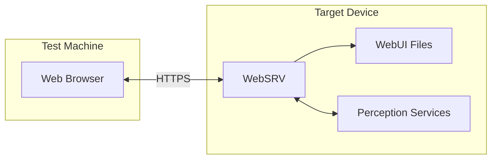

# Testing Guide

This document covers testing procedures for the EdgeFirst WebUI, including environment setup, manual testing workflows, and future test automation.

## Prerequisites

### Supported Platforms

Testing should be performed on EdgeFirst-supported hardware:

| Platform | Description |
|----------|-------------|
| **Maivin** | EdgeFirst Maivin AI camera platform |
| **Raivin** | EdgeFirst Raivin radar+camera platform |
| **i.MX 8M Plus EVK/FRDM** | NXP evaluation kit or freedom board |
| **i.MX 95 EVK/FRDM** | NXP evaluation kit or freedom board |

### Required Components

Testing the WebUI requires both the frontend and backend running together:



## Environment Setup

### 1. Start Perception Services

The WebUI requires EdgeFirst Perception services to be running and publishing data. See the [EdgeFirst Perception Topics](https://doc.edgefirst.ai/test/perception/topics/) documentation for details.

**Core services:**

```bash
# Check service status
sudo systemctl status camera model

# Start core services
sudo systemctl start camera
sudo systemctl start model
```

The `model` service should be configured with a detection or segmentation model. See the EdgeFirst documentation for model configuration.

**Optional services (hardware-dependent):**

```bash
# Radar (requires Raivin)
sudo systemctl start radarpub

# Lidar (requires Ouster or Robosense LiDAR)
sudo systemctl start lidarpub

# IMU (requires Maivin or Raivin)
sudo systemctl start imu

# GPS/GNSS (requires Maivin or Raivin)
sudo systemctl start navsat

# Sensor fusion (requires radarpub or lidarpub running)
sudo systemctl start fusion
```

### 2. Configure WebSRV

Ensure WebSRV is configured to serve the WebUI:

```bash
# Check current configuration
cat /etc/default/webui

# Verify DOCROOT points to WebUI location
# Default: /usr/share/webui
# Custom: /home/torizon/webui or /usr/local/share/webui
```

### 3. Start WebSRV

```bash
# Start the webui service (includes websrv)
sudo systemctl start webui

# Check status
sudo systemctl status webui

# View logs for troubleshooting
sudo journalctl -u webui -f
```

### 4. Access WebUI

From a browser on the same network:

```
https://<device-hostname>.local
# or
https://<device-ip-address>
```

Accept the self-signed certificate when prompted.

## Manual Testing Workflows

### Home Page Verification

1. Navigate to the home page (`/`)
2. Verify the visualization cards are displayed
3. Confirm device-specific features appear (radar on Raivin)
4. Test navigation to each visualization page

**Expected behavior:**
- Cards display with icons and descriptions
- Theme toggle works (light/dark)
- Status bar shows service health

### Camera Stream Testing

1. Navigate to Camera view (`/camera`)
2. Verify H.264 video stream displays
3. Toggle each overlay on/off via the control panel:
   - **Segmentation**: Toggle on, verify mask overlay appears
   - **Bounding Boxes**: Toggle on, verify boxes with labels/confidence
   - **LiDAR Points**: Toggle on, verify projected points appear
4. Test LiDAR overlay color modes (Distance, Cluster, Vision Class, etc.)
5. In Cluster mode, test Noise/Ground filter checkboxes
6. Verify tile upgrade: if 4K tiles are available, video should upgrade automatically

**Expected behavior:**
- Video renders smoothly without artifacts
- Overlay toggles show/hide each layer independently
- Bounding boxes track objects correctly
- Labels show class names and confidence
- LiDAR points in cluster mode: noise (id=0) renders grey, not a hue color
- In non-cluster modes, noise/ground points are NOT filtered even if checkboxes were unchecked
- If tiles are available, video upgrades to 4K and the old fallback texture is disposed

### Combined View Testing

1. Navigate to Combined view (`/combined`)
2. Verify three panels display: video, segmentation, radar grid
3. Check segmentation mask aligns with video
4. Confirm radar points update in real-time

**Expected behavior:**
- All three streams synchronized
- Mask colors match object classes
- Grid shows occupied cells

### 3D LiDAR View Testing

1. Navigate to LiDAR view (`/lidar`)
2. Verify "LiDAR Unavailable" message shows when `lidarpub` is not running
3. Test orbit controls (drag to rotate, scroll to zoom)
4. Verify point cloud renders with colour mapping
5. Test colour mode selector: Fixed, Distance, Cluster, Vision Class
6. Check fusion warning appears when Vision Class or Cluster selected but service unavailable
7. Test cluster filter toggles: uncheck Noise to hide noise points, uncheck Ground to hide ground points
8. Verify toggles only appear in Cluster colour mode
9. Verify toggle state is preserved when switching modes

**Expected behavior:**
- LiDAR card only appears on home page when `lidarpub` is enabled
- "LiDAR Unavailable" overlay when `lidarpub` is enabled but not running
- Smooth 3D navigation with orbit controls
- Distance mode: Turbo colourmap based on point distance from origin
- Fixed mode: Single colour (lavender dark / deep purple light)
- Cluster mode: Distinct colours per cluster ID (requires cluster topic)
- Vision Class mode: Segmentation mask colours per class (requires fusion topic)

### Configuration Pages Testing

1. Navigate to Settings (`/config/settings`)
2. Test each configuration page:
   - Recorder: Start/stop recording, verify file creation
   - Camera: Modify settings, verify camera restarts
   - Services: Check status indicators match actual state
3. Save configurations and verify persistence

**Expected behavior:**
- Forms load current values
- Save operations succeed
- Services restart when required

### Recording Workflow Testing

1. Navigate to Recorder page (`/config/recorder`)
2. Start a recording
3. Verify recording indicator in navbar
4. Stop recording
5. Confirm MCAP file appears in recordings list
6. Test playback of recorded file
7. Test download functionality

**Expected behavior:**
- Recording starts/stops cleanly
- Files listed with correct timestamps
- Playback reproduces recorded data

### Theme Testing

1. Click theme toggle in navbar
2. Verify all pages render correctly in both themes
3. Check diagrams and charts adapt colors
4. Test system preference detection (auto mode)

**Expected behavior:**
- Consistent styling across all pages
- No unreadable text or invisible elements
- Smooth transitions between themes

## Browser Compatibility

Test on supported browsers:

| Browser | Minimum Version | Notes |
|---------|-----------------|-------|
| Chrome | 94+ | Full support |
| Edge | 94+ | Full support |
| Firefox | 97+ | WebCodecs flag may be required |
| Safari | 16.4+ | Limited WebCodecs support |

### Browser-Specific Tests

- **WebCodecs**: Verify hardware video decoding works
- **WebGL**: Confirm 3D rendering performs well
- **WebSockets**: Check real-time streams connect
- **Local Storage**: Verify theme preference persists

## Test Checklist

### Smoke Test (Quick Verification)

- [ ] Home page loads
- [ ] Camera stream displays video
- [ ] Status bar shows green/live
- [ ] Theme toggle works
- [ ] At least one config page loads

### Full Test Suite

**Navigation:**
- [ ] All visualization pages accessible
- [ ] All configuration pages accessible
- [ ] Navbar renders on all pages
- [ ] Back/forward browser navigation works

**Video Streaming:**
- [ ] Single stream mode works
- [ ] Tiled 4K mode works (if supported)
- [ ] Fallback to single stream works
- [ ] Frame rate is acceptable

**AI Visualization:**
- [ ] Detection boxes render
- [ ] Box colors are consistent per object
- [ ] Segmentation mask displays
- [ ] Mask aligns with video

**Sensors:**
- [ ] Radar points render (Raivin)
- [ ] Lidar points render
- [ ] GPS map shows position
- [ ] IMU orientation displays

**Configuration:**
- [ ] All forms load current values
- [ ] Changes save successfully
- [ ] Service restarts work
- [ ] Validation prevents invalid input

**Recording:**
- [ ] Start recording works
- [ ] Stop recording works
- [ ] File list updates
- [ ] Download works
- [ ] Playback works
- [ ] Delete works

## Test Automation

The WebUI includes semantic test IDs on key elements to enable automated testing with tools like Selenium, Playwright, or Cypress.

### Test ID Convention

Elements use `data-testid` attributes with consistent naming:

```
data-testid="<page>-<element>-<name>"
```

**Examples:**
- `index-card-camera` - Camera card on home page
- `index-card-gps` - GPS card on home page
- `settings-card-recorder` - Recorder card on settings page
- `settings-card-services` - Services card on settings page

### Available Test IDs

**Home Page (`index.html`):**
- `index-card-camera`
- `index-card-combined`
- `index-card-lidar` (visible when `lidarpub` enabled)
- `index-card-segmentation`
- `index-card-grid`
- `index-card-gps`
- `index-card-imu`

**Camera Page (`camera.html`):**
- `camera-viewport` - Main viewport container
- `camera-player` - Video canvas
- `camera-boxes` - Bounding box overlay canvas
- `camera-lidar-overlay` - LiDAR projection overlay canvas
- `camera-controls` - Overlay control panel
- `camera-controls-header` - Control panel header
- `camera-overlay-segmentation` - Segmentation section
- `camera-toggle-segmentation` - Segmentation toggle checkbox
- `camera-overlay-box2d` - Bounding boxes section
- `camera-toggle-box2d` - Bounding boxes toggle checkbox
- `camera-options-box2d` - Bounding box sub-options
- `camera-box2d-labels` - Show labels checkbox
- `camera-box2d-confidence` - Show confidence checkbox
- `camera-overlay-lidar` - LiDAR overlay section
- `camera-toggle-lidar` - LiDAR toggle checkbox
- `camera-options-lidar` - LiDAR sub-options
- `camera-lidar-color-mode` - LiDAR colour mode selector
- `camera-lidar-cluster-filters` - Cluster filter container
- `camera-lidar-noise` - Noise filter checkbox
- `camera-lidar-ground` - Ground filter checkbox
- `camera-unavailable` - Camera unavailable overlay

**LiDAR Page (`lidar.html`):**
- `lidar-viewport` - 3D viewport container
- `lidar-controls` - Controls container (dropdown + cluster filters)
- `lidar-color-mode` - Colour mode selector (Fixed, Distance, Cluster, Vision Class)
- `lidar-cluster-filters` - Noise/Ground filter checkboxes (visible in Cluster mode)
- `lidar-show-noise` - Noise filter checkbox
- `lidar-show-ground` - Ground filter checkbox
- `lidar-fusion-warning` - Warning banner when fusion data unavailable
- `lidar-unavailable` - Overlay when LiDAR data is not being received

**Segmentation Page (`segmentation.html`):**
- `segmentation-container` - Main container
- `segmentation-viewport` - Viewport wrapper
- `segmentation-player-div` - Player container
- `segmentation-player` - Video canvas
- `segmentation-boxes` - Overlay canvas

**Combined Page (`combined.html`):**
- `combined-container` - Main container
- `combined-viewport` - Viewport wrapper
- `combined-player-div` - Player container
- `combined-player` - Video canvas
- `combined-boxes` - Overlay canvas
- `combined-grid-div` - Grid container
- `combined-grid` - Grid canvas

**GPS Page (`gps.html`):**
- `gps-data` - Data overlay container
- `gps-timeout` - Timeout status indicator
- `gps-latitude` - Latitude display
- `gps-longitude` - Longitude display
- `gps-btn-refresh` - Refresh button
- `gps-map` - Map container

**IMU Page (`imu.html`):**
- `imu-data` - Data overlay container
- `imu-timeout` - Timeout status indicator
- `imu-roll` - Roll display
- `imu-pitch` - Pitch display
- `imu-yaw` - Yaw display
- `imu-btn-reset` - Reset orientation button

**JPEG Page (`jpeg.html`):**
- `jpeg-timeout` - Timeout status indicator
- `jpeg-image-container` - Image container
- `jpeg-image` - JPEG image element

**Grid Page (`grid.html`):**
- `grid-main-container` - Main container

**Settings Page (`config/settings.html`):**
- `settings-card-recorder`
- `settings-card-camera`
- `settings-card-model`
- `settings-card-lidar` (visible when `lidarpub` enabled)
- `settings-card-radar` (visible when `radarpub` enabled)
- `settings-card-fusion` (visible when `fusion` enabled)
- `settings-card-services`
- `settings-card-studio`

### Selenium Example

```python
from selenium import webdriver
from selenium.webdriver.common.by import By
from selenium.webdriver.support.ui import WebDriverWait
from selenium.webdriver.support import expected_conditions as EC

# Setup
driver = webdriver.Chrome()
driver.get("https://maivin.local")

# Accept self-signed certificate (browser-specific handling required)

# Navigate using test IDs
camera_card = WebDriverWait(driver, 10).until(
    EC.element_to_be_clickable((By.CSS_SELECTOR, "[data-testid='index-card-camera']"))
)
camera_card.click()

# Verify page loaded
assert "camera" in driver.current_url

# Navigate to settings
driver.get("https://maivin.local/config/settings")

# Click recorder settings
recorder_card = driver.find_element(By.CSS_SELECTOR, "[data-testid='settings-card-recorder']")
recorder_card.click()

driver.quit()
```

### Playwright Example

```javascript
const { test, expect } = require('@playwright/test');

test('navigation flow', async ({ page }) => {
  // Navigate to home
  await page.goto('https://maivin.local');

  // Click camera card
  await page.click('[data-testid="index-card-camera"]');
  await expect(page).toHaveURL(/camera/);

  // Navigate to settings
  await page.goto('https://maivin.local/config/settings');

  // Verify settings cards visible
  await expect(page.locator('[data-testid="settings-card-recorder"]')).toBeVisible();
  await expect(page.locator('[data-testid="settings-card-services"]')).toBeVisible();
});
```

### Future Automation Recommendations

1. **Visual Regression Testing**: Use tools like Percy or Chromatic to detect UI changes
2. **Performance Testing**: Monitor frame rates and stream latency
3. **Cross-Browser Matrix**: Automate testing across Chrome, Firefox, Edge
4. **Device Farm**: Test on actual Maivin/Raivin hardware in CI/CD
5. **WebSocket Mocking**: Create mock servers for isolated frontend testing

### Adding New Test IDs

When adding new UI elements, follow the convention:

```html
<a href="/new-page" data-testid="index-card-newfeature">New Feature</a>
```

Use lowercase, hyphens for word separation, and include the page context.

## Troubleshooting

### No Video Stream

1. Check camera service is running: `systemctl status camera`
2. Verify Zenoh connectivity: `zenoh-cli scout`
3. Check browser console for WebSocket errors
4. Try different browser (Chrome recommended)

### Services Not Starting

1. Check service logs: `journalctl -u <service> -n 50`
2. Verify hardware connections (camera, radar, lidar)
3. Check device permissions
4. Review EdgeFirst documentation for platform-specific setup

### Configuration Not Saving

1. Check WebSRV logs for errors
2. Verify file permissions on config files
3. Ensure service has write access to `/etc/default/`

### WebSocket Connection Failed

1. Verify WebSRV is running: `systemctl status webui`
2. Check firewall allows ports 80/443
3. Confirm HTTPS certificate is accepted
4. Check browser console for errors

## Related Documentation

- [ARCHITECTURE.md](ARCHITECTURE.md) - System architecture
- [WebSRV TESTING.md](https://github.com/EdgeFirstAI/websrv/blob/main/TESTING.md) - Backend testing
- [EdgeFirst Perception Topics](https://doc.edgefirst.ai/test/perception/topics/) - Service configuration
